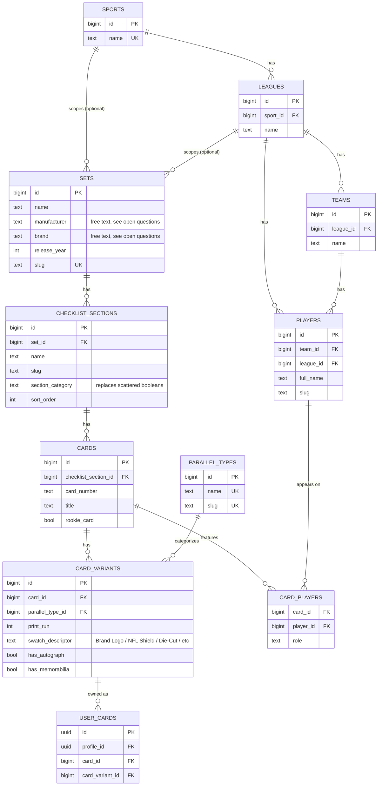

# TheBinder Catalog v2 — Entity Relationship Documentation

Status: **proposed, pre-migration**. This document describes the target schema validated against the real 2025 Panini Select Football checklist (1 Set, 44 ChecklistSections, 1,721 Cards, 27,870 Variants, 593 Players, 138 Teams) during the offline catalog-import analysis work. Nothing here has been migrated, and no application code has been changed to match it yet — see [database.md](database.md) for the schema as it exists today.

## 1. Catalog v2 overview

The current (v1) schema keys `cards` by `(set_id, card_number)`. That held up as long as a "set" and a "product release" were the same thing. The real Select Football checklist broke that assumption: **one release is one Set, but it contains 44 distinct checklist sections (Base Club Level, Rookie Signatures, Draft Selections Memorabilia, etc.), and different sections restart card numbering from 1.** Keying cards by set alone collapses unrelated cards from different sections onto the same identity the moment two sections both have a "#1".

Catalog v2 inserts one new level into the hierarchy — **ChecklistSection**, sitting between Set and Card — so a card's identity is `(checklist_section_id, card_number)` instead of `(set_id, card_number)`. Everything else in the existing catalog (players, teams, leagues, sports, parallel types, card_players, user_cards) keeps its current shape and relationships; only the Set → Card path grows a level, and CardVariant gains a field (`swatch_descriptor`) to capture jersey-tag/manufacturer-logo text that turned out to be a real, distinct dimension in Beckett's own data.

This mirrors exactly what the offline entity builder (`scripts/catalog-import/build-catalog-entities.ts`) now produces in memory; this document is the DB-side counterpart of that already-validated in-memory model.

## 2. Entity relationship diagram



The `SPORTS/LEAGUES ||--o{ SETS` relationship is drawn "optional" because `sets.sport_id`/`sets.league_id` already exist in the current schema but are nullable and not populated by the import pipeline yet (no sport-selection UI exists) — v2 doesn't need to resolve this, it's a pre-existing gap, not a new one.

## 3. Table responsibilities

| Table | Responsibility |
|---|---|
| `sports` | Top of the sport/league/team/player hierarchy (e.g. "Football"). Unrelated to the Set→Card path except as optional context on `sets`/`players`/`teams`. |
| `leagues` | One league per sport (e.g. "NFL"). Scopes `teams` and `players`. |
| `teams` | One team per league. Real checklists reference decades of teams (retired/relocated included), so this table needs to grow well beyond any small hardcoded list once real bulk imports write to it. |
| Manufacturer/Brand (`sets.manufacturer`/`sets.brand`, **or** future `manufacturers`/`brands` tables) | Identifies who produced a release (e.g. "Panini" / "Select"). Currently free-text columns on `sets`, not normalized tables — see open questions. `docs/architecture/database.md` already describes an aspirational `manufacturers`/`brands` table pair that was never actually migrated; this document doesn't resolve that gap, just surfaces it again in the v2 context. |
| `sets` | One row per release (e.g. "2025 Panini Select Football"). The top of the card-identity hierarchy. Does **not** get a `checklist_section_id` — sections belong to sets, not the reverse. |
| `checklist_sections` | **New in v2.** One row per section within a set (e.g. "Base Club Level", "Rookie Signatures", "Draft Selections Memorabilia"). Owns the base-vs-insert and autograph/memorabilia classification that used to be guessed per-card. |
| `cards` | One row per physical card design: a specific card number within a specific section. No longer references `sets` directly for identity purposes (still may keep a denormalized `set_id` for query convenience — see design decisions). |
| `card_variants` | One row per parallel/print-run/swatch-descriptor combination of a card. This is where a card's specific "flavor" (Silver Prizm, /99, Die-Cut, jersey-tag type) lives. |
| `parallel_types` | Global, cross-set lookup of parallel names (e.g. "Silver Prizm" is the same `parallel_types` row whether it shows up in this release or a different one). Unchanged by v2. |
| `card_players` | Join table: which player(s) appear on a given card. Unchanged by v2 — this redesign doesn't touch it at all. |
| `players` | One row per player, optionally scoped to a team/league. Unchanged by v2. |
| `user_cards` | A profile's owned copy of a catalog card (+ optional variant). Unchanged by v2 — it references `cards`/`card_variants` by id exactly as before; it doesn't need to know sections exist. |

## 4. Recommended key constraints

```sql
-- checklist_sections: unique within a set
constraint checklist_sections_set_id_slug_key
  unique (set_id, slug)

-- cards: unique within a checklist section (replaces set_id + card_number)
constraint cards_checklist_section_id_card_number_key
  unique (checklist_section_id, card_number)

-- card_variants: unique within a card, across parallel + print run + swatch descriptor
constraint card_variants_uniqueness_key
  unique (card_id, parallel_type_id, print_run, swatch_descriptor)

-- card_players: unchanged, already correct
primary key (card_id, player_id)
```

Note on `card_variants`: the flags (`has_autograph`/`has_memorabilia`) are deliberately **not** part of this constraint — they describe what a variant *is*, not an independent axis two otherwise-identical variants could differ on. Including them in the unique scope (as an earlier draft of this plan considered) would be redundant with `parallel_type_id`/`swatch_descriptor`, which already imply the flags. Open to revisiting if a real data case shows this wrong.

## 5. Important design decisions

- **`checklist_sections` are first-class entities**, not a text field on `cards`. This is the core fix: a section (with its own autograph/memorabilia/base-insert classification) is something many cards belong to, not an attribute guessed per-card.
- **`cards` does not duplicate `set_id` as its identity key.** The set is reached by walking `cards.checklist_section_id → checklist_sections.set_id`. (A denormalized `set_id` column may still exist on `cards` for query convenience, but it is not part of any uniqueness constraint and is never the source of truth — `checklist_section_id` is.)
- **`section_category` should replace scattered section booleans.** Rather than independent `is_base`/`is_insert`/`is_autograph`/`is_memorabilia` flags that could in principle contradict each other, a single categorical column (e.g. `'base' | 'insert' | 'autograph' | 'memorabilia' | 'autograph_memorabilia'`) is the more honest representation — `analyzeCardSet()` already produces exactly this as one deterministic decision per section, not four independent guesses.
- **Beckett's CARD SET text maps to three separate things, not one**: the checklist section (e.g. "Rookie Signatures"), the parallel (e.g. "Black Prizm"), and a trailing descriptor (e.g. "Brand Logo", "Die-Cut") — confirmed against all 423 real distinct CARD SET values with zero ambiguous splits. Treating CARD SET as a single opaque string (the v1 assumption) is what caused the original set-identity collision.
- **`user_cards` keeps referencing `cards`/`card_variants` exactly as it does today.** A user's owned card doesn't need to know about checklist sections at all — it just points at whichever `cards`/`card_variants` row is correct, and that row happens to now be reached via a section instead of directly via a set.

## 6. Import pipeline mapping

```
Beckett row
  → Set             (release_year + manufacturer + brand + sport, e.g. "2025 Panini Select Football")
    → ChecklistSection   (CARD SET text minus its parallel/descriptor, e.g. "Rookie Signatures")
      → Card              (checklist_section + card_number)
        → CardVariant     (parallel_type + print_run + swatch_descriptor + flags)
          → CardPlayer    (card + player, from ATHLETE)
```

This is exactly what `scripts/catalog-import/build-catalog-entities.ts` already builds in memory today (offline, no DB writes), using `analyze-card-set-patterns.ts`'s `analyzeCardSet()`/`normalizeParallelName()` to do the CARD SET decomposition. This document describes the DB schema that in-memory model is designed to eventually be written into — the import pipeline does not change as a result of this document; it was already built to this shape.

## 7. Risks and open questions

- **Should `manufacturers`/`brands` become real tables now, or stay as `sets.manufacturer`/`sets.brand` free text?** `docs/architecture/database.md` already describes them as top-level catalog tables in the aspirational design, but the actual migrated schema only has free-text columns. Catalog v2 doesn't have to resolve this to work, but leaving it unresolved means "Panini" and "panini" (or any future typo) could quietly fork instead of sharing one row.
- **How should `section_category` be categorized precisely?** `analyzeCardSet()`'s keyword-based classification is directionally solid (0 ambiguous splits against the real file) but has a known gap: sections like "Sparks" or "Multiverse Jerseys" are memorabilia inserts whose names don't contain any of the literal keywords the classifier scans for. A durable categorization likely needs a small human-reviewed section→category override table (only ~44 rows for this one release) rather than pure keyword inference.
- **How should swatch descriptors be handled long-term?** They're confirmed real and load-bearing (1,170 of 27,870 real variants carry one), but there's no existing UI concept for them at all — they need a place to display, not just a place to store.
- **How should search/ranking use section context?** Today, `rankingEngine.ts` scores an exact card-number match as the single highest, standalone signal (100 points). Once one Set has 44+ sections that can share overlapping card numbers, that scoring breaks down — a number-only search can't disambiguate which section's "#1" the user means. This needs a section-aware scoring signal before any checklist like this one is actually imported, or catalog search quality visibly regresses.

---

No migrations were created, no application code was changed, no database connection was made, and nothing was committed as part of this document.
